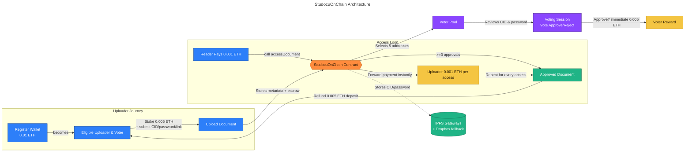

# StudocuOnChain

StudocuOnChain is a decentralized document marketplace where students and reviewers collaborate on-chain. Uploaders stake ETH, voters review for rewards, and readers pay to unlock approved documents with password-gated previews.

## Live Deployments

- Production dApp (Vercel): <https://interface-demo-vert.vercel.app/>

## Smart Contract (Sepolia)

- Address: `0xf751BB12227808FD05BdF78917063b876A01F7c9`
- Explorer: <https://sepolia.etherscan.io/address/0xf751BB12227808FD05BdF78917063b876A01F7c9#code>
- Name: `StudocuOnChain`
- Compiler: Solidity `v0.8.30` (optimization disabled, 200 runs)
- Key constants:
  - `REGISTRATION_FEE = 0.01 ETH`
  - `UPLOAD_DEPOSIT = 0.005 ETH` (refunded on approval)
  - `VOTE_REWARD = 0.005 ETH`
  - `ACCESS_FEE = 0.001 ETH`
  - `APPROVAL_THRESHOLD = 3` of `REQUIRED_VOTERS = 5`
- Event feed shows registrations, uploads, votes, and access payouts in real time.

> To ship to Ethereum mainnet later: redeploy `StudocuOnChain.sol`, verify the new address on the mainnet explorer, and update `InterfaceDemo/src/contracts/studocu_config.js` with the mainnet address + ABI.

## Architecture Overview



> The diagram lives at `docs/architecture/studocu-onchain-architecture.mmd`. Use `@mermaid-js/mermaid-cli` if you prefer a PNG export.

## Product Highlights

- **Registration** – Wallets join the network by paying `0.01 ETH`.
- **Uploads** – Submit an IPFS hash, document password, and a reviewer-facing fallback link while staking `0.005 ETH`.
- **Voting** – Five random voters are assigned; each approval vote immediately earns `0.005 ETH`.
- **Access Flow** – Readers pay `0.001 ETH` to unlock the password, then preview the PDF in-app (password required) with Dropbox/IPFS fallback links.
- **History & Analytics** – Upload, vote, and access history is persisted client-side; live updates stream from contract events (no polling).
- **UI Updates** – Navbar links: Login · Profile · Upload · Vote · History. Vote badges color-code approval counts (yellow for 1–2, green for ≥3).

## Repository Layout

```
StudocuOnChain/
├── InterfaceDemo/          # React dApp + contract sources
│   ├── src/
│   │   ├── components/     # UI modules (login, registration, voting, history)
│   │   ├── contracts/      # Solidity + ABI configs
│   │   └── utils/          # Helpers (avatar, IPFS tools, etc.)
│   └── package.json
├── docs/
│   └── architecture/       # Mermaid diagram + assets for documentation
└── README.md
```

## Local Development

```bash
cd InterfaceDemo
npm install
npm start           # launches CRA dev server on http://localhost:3000
```

For production builds:

```bash
npm run build       # generates /build
```

## Deployment (Vercel)

```bash
# Preview deploy (linked project remembered by Vercel CLI)
vercel

# Promote the latest build to production
vercel --prod

# Create a new project with a specific name (e.g., studocuonchain)
vercel --prod --name studocuonchain
```

The repo ships with `vercel.json` to ensure SPA routing works for deep links (all non-static paths rewrite to `index.html`).

## Working with the Contract

- Remix deployment: connect MetaMask, select Sepolia (or target network), compile `StudocuOnChain.sol` with `v0.8.30`, optimization off.
- Verification: submit the same compiler settings and Solidity source through Etherscan (“Verify and Publish”). The contract is already verified on Sepolia; replicate the process for new networks.
- Frontend config: update `InterfaceDemo/src/contracts/studocu_config.js` whenever the contract address or ABI changes.

## Credits

- Original InterfaceDemo project by Yan Ge (2022–2024): <https://github.com/dududududulu/InterfaceDemo/>
- StudocuOnChain customization and blockchain integration (2025): Arnav Salkade, Barna Saha, Andrei Radu, Pratyush Singh, and collaborators.
